# Little Monster (LM) - Business Process Flows
## GPA Study Platform Business Operations

**Version**: 1.0  
**Last Updated**: October 30, 2025  
**Document Type**: Business Process Documentation  
**Scope**: End-to-end business workflows and user journeys

---

## 1. Executive Summary

This document defines the core business processes for the Little Monster GPA study platform, mapping user journeys, system interactions, and operational workflows. These processes serve as the foundation for technical implementation and user experience design.

## 2. Core Business Process Flows

### 2.1 Student Onboarding & Account Management

#### 2.1.1 New User Registration Flow
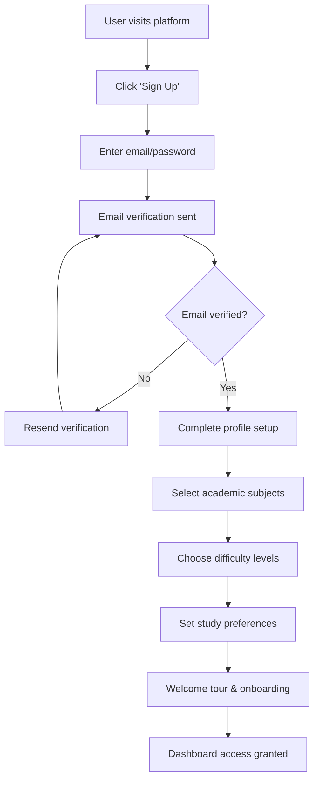

**Key Decision Points:**
- Email domain validation (school vs. personal)
- Subject selection (minimum 1, maximum 6)
- Difficulty level assessment
- Privacy settings configuration

**Business Rules:**
- Account activation within 24 hours or auto-deletion
- Minimum profile completion required for full access
- Subject preferences can be modified after setup
- Tutorial completion tracked for user support

#### 2.1.2 User Authentication & Session Management
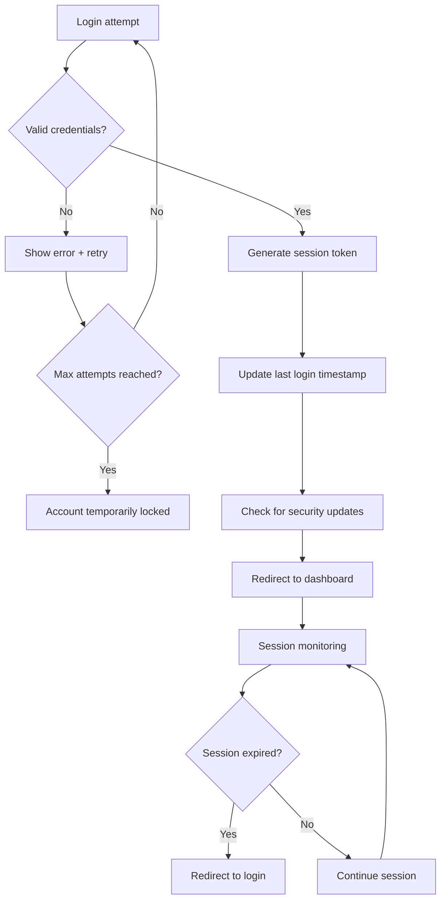

### 2.2 AI-Powered Video Generation Workflow

#### 2.2.1 Content Generation Request Flow
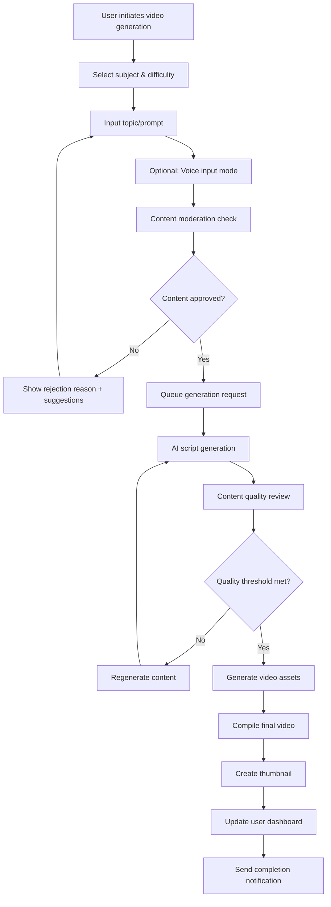

**Key Business Rules:**
- Maximum 5 generation requests per day (free tier)
- Content must pass AI moderation filters
- Generation time: 2-5 minutes average
- Failed generations don't count toward daily limit

#### 2.2.2 Content Moderation & Quality Assurance
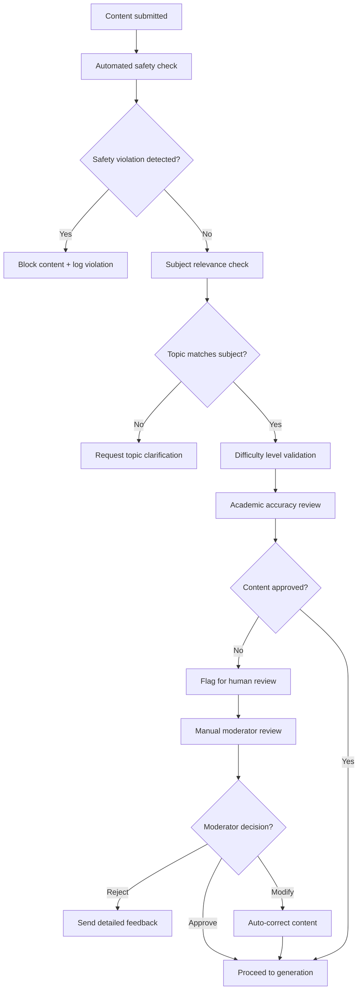

### 2.3 Study Session Management & Progress Tracking

#### 2.3.1 Study Planner Workflow
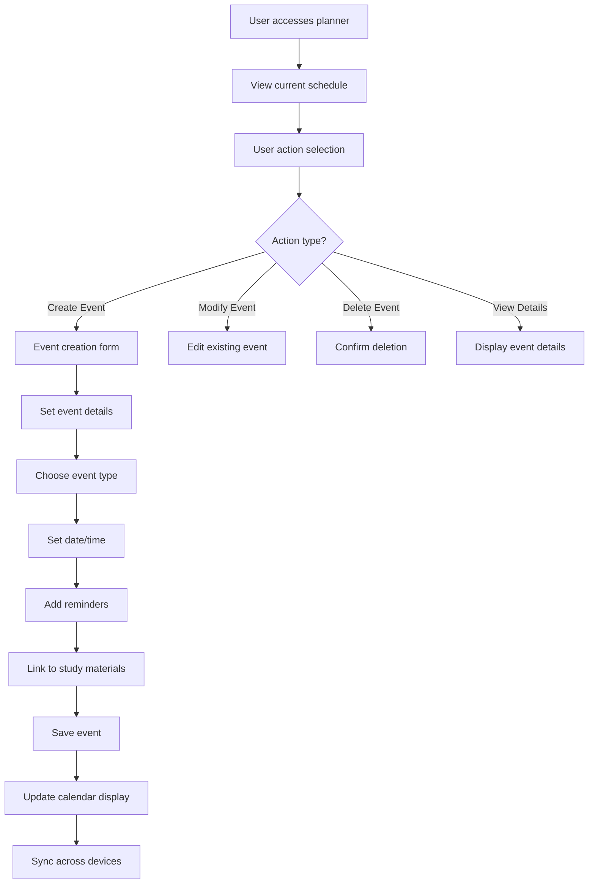

**Event Types Supported:**
- Study sessions (individual/group)
- Assignment deadlines
- Exam schedules
- Project milestones
- Review sessions

#### 2.3.2 Progress Tracking & Analytics
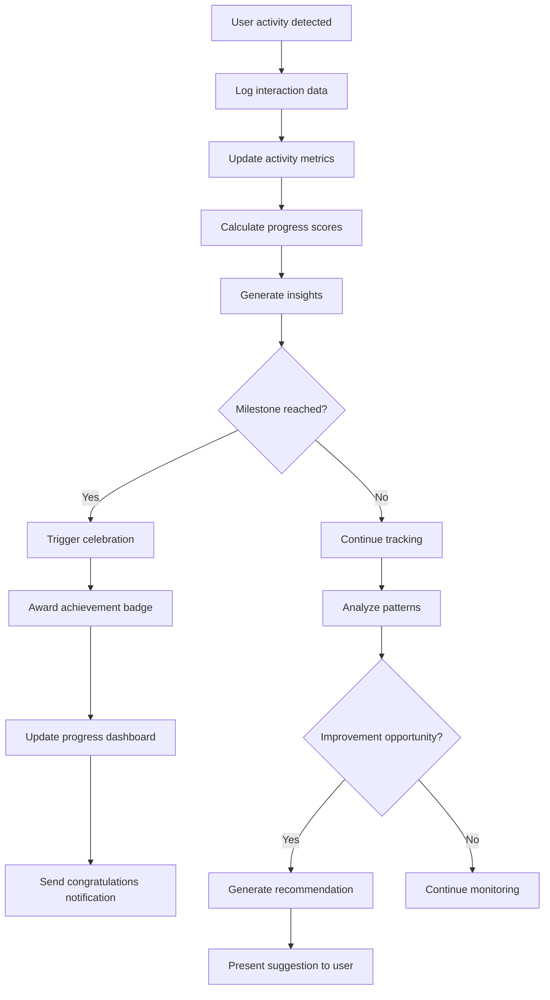

### 2.4 Community Interaction & Content Sharing

#### 2.4.1 Video Discovery & Engagement Flow
```melmaid
graph TD
    A[User browses video feed] --> B[Apply filters/search]
    B --> C[Display curated content]
    C --> D[User selects video]
    D --> E[Load video player]
    E --> F[Track viewing metrics]
    F --> G[User interaction options]
    G --> H{Interaction type?}
    
    H -->|Rate| I[Submit rating]
    H -->|Comment| J[Compose comment]
    H -->|Share| K[Generate share link]
    H -->|Save| L[Add to favorites]
    H -->|Report| M[Flag content]
    
    I --> N[Update video rating average]
    J --> O[Moderation check]
    O --> P{Comment approved?}
    P -->|Yes| Q[Post comment]
    P -->|No| R[Notify user of rejection]
    
    K --> S[Copy to clipboard/share via platform]
    L --> T[Add to user's saved content]
    M --> U[Queue for moderator review]
```

#### 2.4.2 Creator Profile & Reputation System
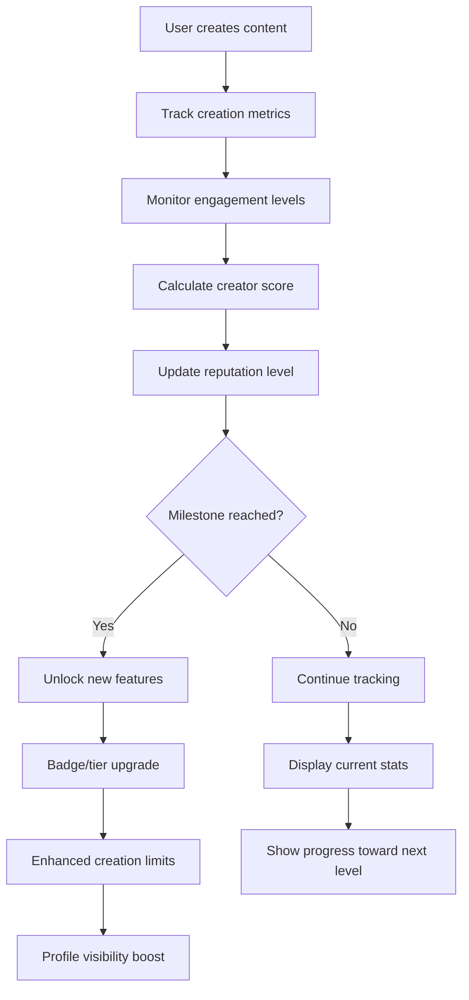

## 3. Administrative & Operational Processes

### 3.1 Content Moderation Workflow

#### 3.1.1 Automated Content Screening
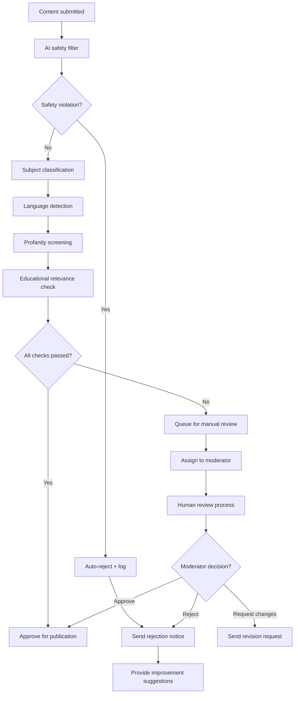

#### 3.1.2 Community Reporting & Appeals
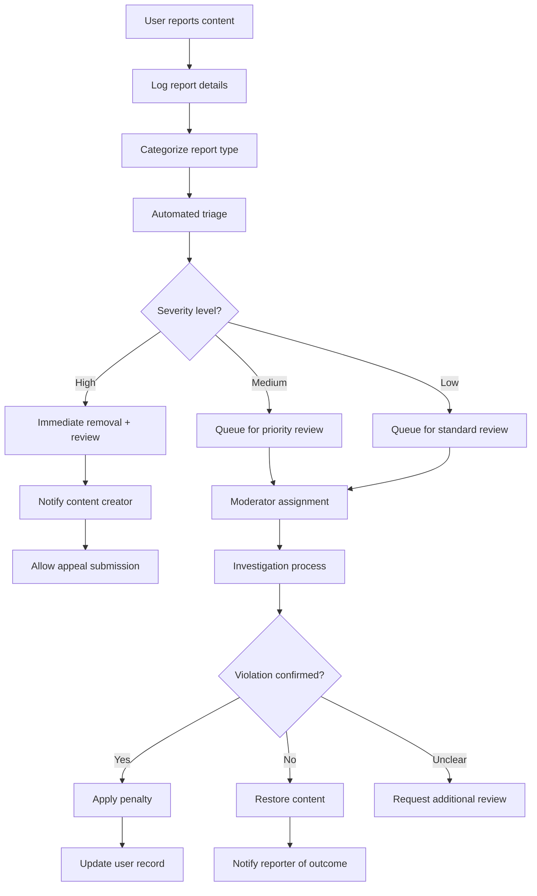

### 3.2 User Support & Issue Resolution

#### 3.2.1 Help Desk Workflow
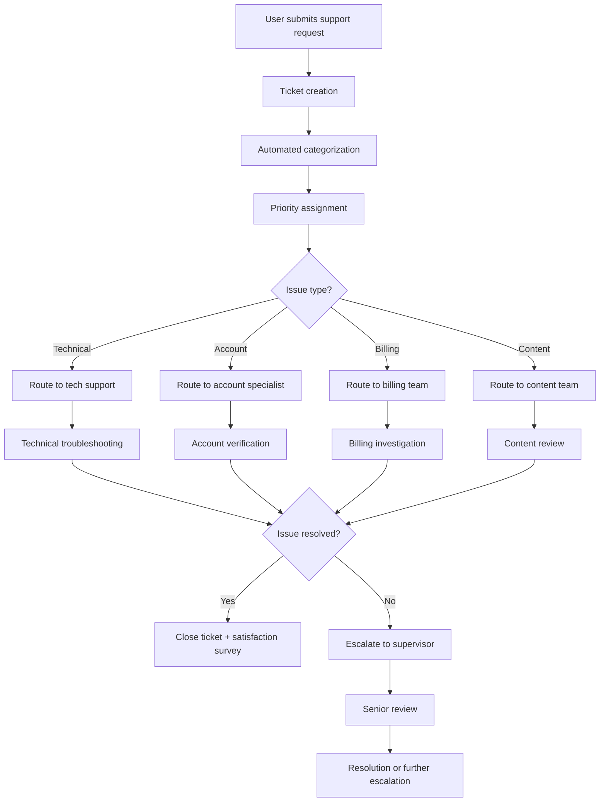

### 3.3 Analytics & Performance Monitoring

#### 3.3.1 System Health Monitoring
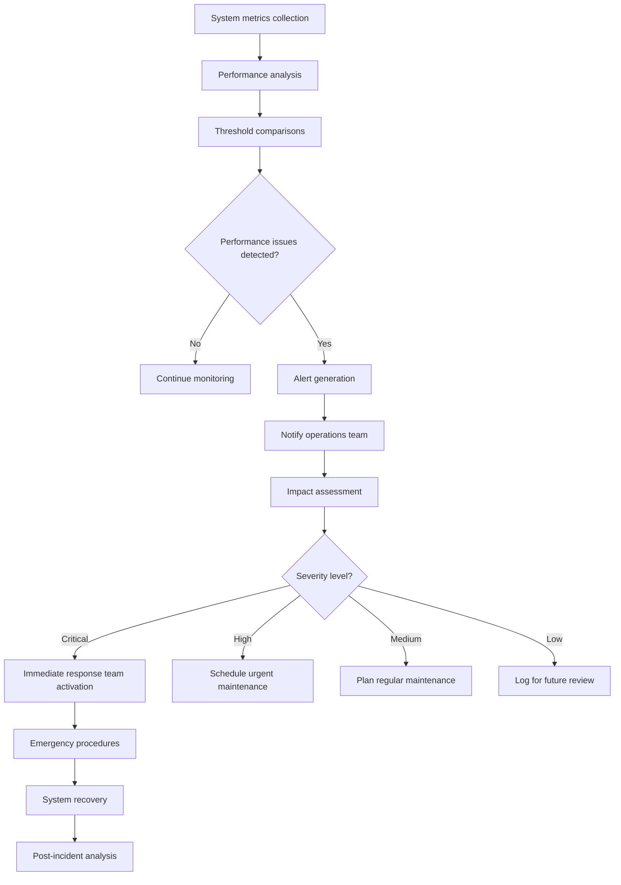

## 4. Business Intelligence & Decision Support

### 4.1 User Behavior Analytics

#### 4.1.1 Engagement Pattern Analysis
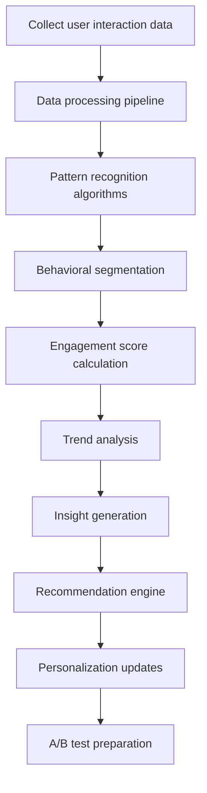

**Key Metrics Tracked:**
- Session duration and frequency
- Content creation and consumption patterns
- Feature adoption rates
- User retention and churn indicators
- Academic performance correlations

### 4.2 Business Performance Monitoring

#### 4.2.1 KPI Dashboard & Reporting
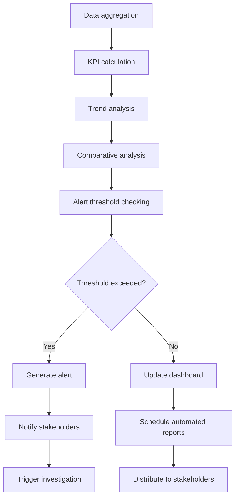

## 5. Integration & External System Workflows

### 5.1 Third-Party Service Integration

#### 5.1.1 Educational Platform Synchronization
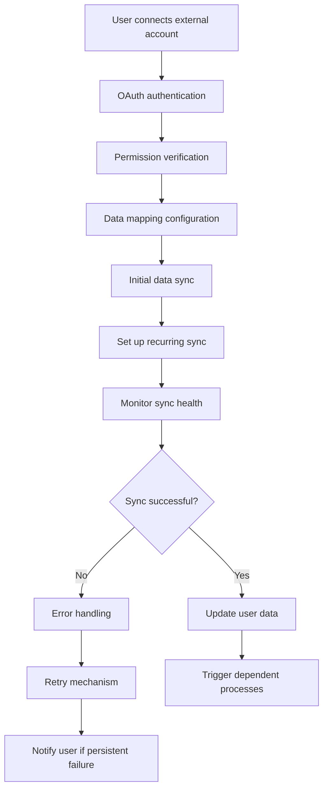

### 5.2 Payment Processing & Subscription Management

#### 5.2.1 Premium Subscription Workflow
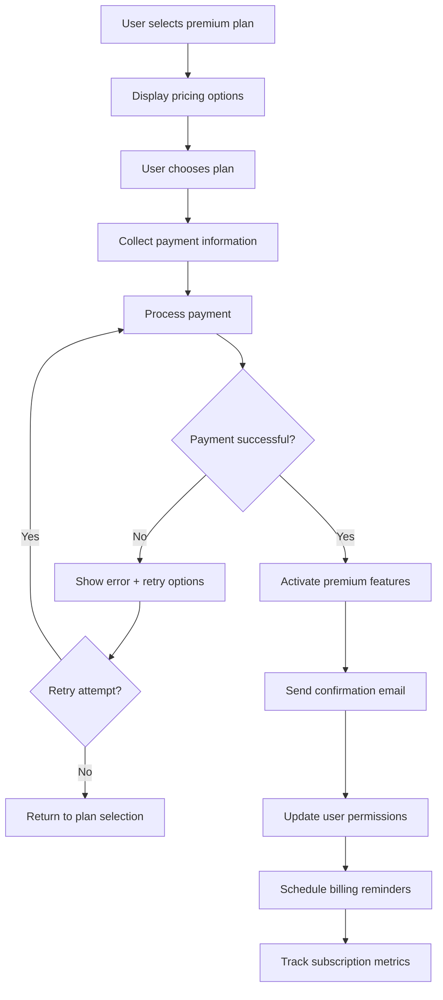

---

These business processes form the operational backbone of the Little Monster platform, ensuring consistent user experiences, efficient content management, and scalable business operations across all platform implementations.
