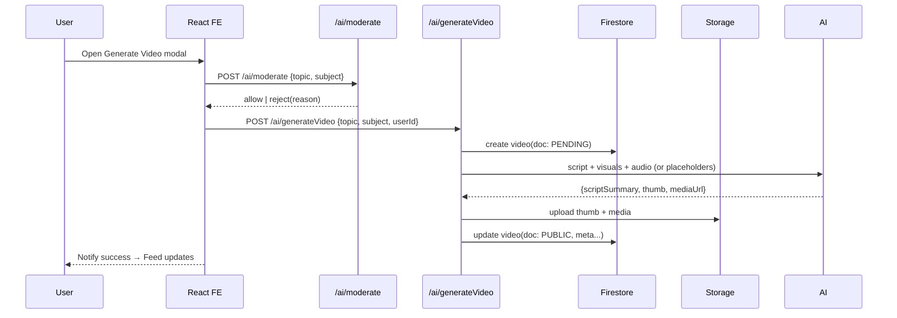
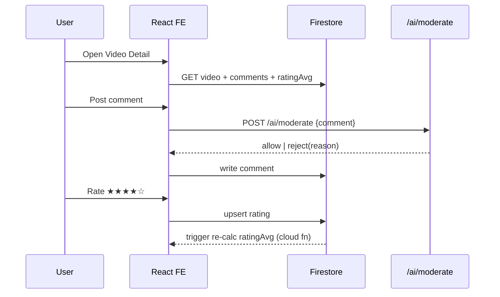

# Little Monster (LM) — v1.3+ System Design (Developer-Facing)

_Last updated: Oct 30, 2025 — Author: LM (Little Monster)_

> Scope: Developer-grade specification for LM’s adaptive study platform with **AI‑generated public video feed**, comments, star ratings, creator profiles, and strict academic moderation. This document prioritizes implementation clarity over marketing.

---

## 0. Problem Statement & Requirements Summary

**Problem**: Students lack a single workspace that (1) keeps them organized, (2) teaches with personalized, high‑quality, short study videos, and (3) lets them learn from peers’ content while staying school‑safe.

**LM Goals (v1.3+)**
1. Desktop-first, **no‑scroll** core surfaces (Home, Planner, Subjects landing) with fast TTI (<1.5s P95 on decent Chromebook).
2. **Public AI Video Feed**: Every user can generate an AI study video; all such videos are public, rateable (1–5 stars), and commentable.
3. **Strict Moderation**: All prompts and comments must be school‑related and clean.
4. **Personalization**: Basic level today (subject + difficulty); roadmap for adaptive paths.
5. **Offline-resilient**: Critical UI + cached catalogs work with degraded functionality.

**Non‑Goals (current release)**: Human uploads, long-form streaming editor, mobile-first polish, SSO enterprise integrations.

---

## 1. High-Level Architecture

**Pattern**: Client‑heavy React app + Serverless/MBaaS backend (Firebase/Supabase), with an **AI Orchestration Service** for generation & moderation. Realtime where helpful, otherwise REST.

```
Browser (React + Tailwind)
  ├─ UI Modules: Home, Subjects, Planner, Play, Videos, Customize
  ├─ Data Layer: React Query / Zustand stores
  ├─ Services: ApiClient, Media, Auth, Moderation, Generation
  └─ Cache: LocalStorage + IndexedDB (thumbnails, catalogs)

Backend
  ├─ Auth: Firebase Auth (email/domain restrictions)
  ├─ DB: Firestore (users, videos, comments, ratings)
  ├─ Storage: Firebase Storage (thumbnails, mock MP4)
  ├─ Cloud Functions / Supabase Edge Functions:
  │    • /ai/generateVideo (idempotent)
  │    • /ai/moderate (prompt/comments)
  │    • /videos/reindex (denormalized stats)
  │    • /analytics/ingest
  └─ CDN: Firebase Hosting / Vercel static cache

AI Layer
  ├─ Prompt Validator (classification + policy checks)
  ├─ Script Generator (LLM)
  ├─ Narration Synth (TTS or placeholder audio)
  ├─ Visual Renderer (slide compositor; placeholder for v1.3)
  └─ Summarizer (key points + timestamps)
```

### 1.1 Sequence: Generate & Publish AI Video


### 1.2 Sequence: View, Comment, Rate


---

## 2. Frontend Design

### 2.1 Framework & Constraints
- **React + Vite** for fast dev and small bundles; **TailwindCSS** for design.
- Router: **React Router** with code-split routes.
- State: **Zustand** for app state (lightweight), **React Query** for server data.
- **No-scroll surfaces** enforce fixed viewport layout; internal panels can scroll.

### 2.2 Route Map
- `/` Home
- `/subjects` (grid)
- `/subjects/:id` (math|chem|history|english workspace)
- `/planner` (Month)
- `/play` (hub: Snake, 2048, TicTacToe)
- `/videos` (Feed)
- `/videos/:id` (Detail)
- `/users/:id` (Creator profile)
- `/customize` (LM theme/avatar)

### 2.3 Component Tree (Selected)
```
<App>
 ├─ <Header/>
 ├─ <RouteSwitch>
 │   ├─ <Home/>
 │   ├─ <Subjects/>
 │   ├─ <SubjectWorkspace/>
 │   ├─ <Planner/>
 │   ├─ <Play/>
 │   ├─ <VideoFeed/>
 │   ├─ <VideoDetail/>
 │   ├─ <CreatorProfile/>
 │   └─ <Customize/>
 └─ <AvatarLM/> (hidden on Home)
```

**Video Module**
- `VideoFeed` (grid + filters + sort)
- `VideoCard` (thumb, title, ★, subject, creator)
- `GenerateVideoModal` (topic, subject, level)
- `VideoDetail` (player, meta, LMNotes, Comments, RatingStars, Share)
- `CommentsSection` (list + input + profanity guard)
- `RatingStars` (controlled, debounced write)
- `CreatorProfile` (user’s videos, stats)

### 2.4 State Stores (Zustand)
```ts
useUser: { id, name, email, avatarColor }
usePrefs: { themeAccent, lmColor }
usePlanner: { events[], add(), update(), remove() }
useVideos: { feed[], filters, sort, fetchFeed(), fetchDetail(id) }
```

### 2.5 Data Fetching (React Query)
- Keys: `videos.feed(filters, sort)`, `videos.detail(id)`, `users.detail(id)`
- StaleTime: 60s for feed; 5m for user profiles
- Retry: 1 (show toast on failure)
- Suspense boundaries on route-level; skeleton UIs

### 2.6 Performance & UX Targets
- **TTI**: <1.5s P95 (wired), <2.5s P95 (wi‑fi)
- **CLS**: <0.03; avoid layout shift by reserving thumbnail aspect ratios
- **Cache**: thumbnails via IndexedDB; feed meta via Query cache
- **Keyboard**: games + navigation fully keyboard-accessible

---

## 3. Backend Design

### 3.1 Chosen Platform
- **Firebase**: Auth, Firestore, Storage, Hosting, Functions
- Alternative: Supabase (Postgres + Storage + Edge Functions) – keep API parity in adapters

### 3.2 Collections & Indexes (Firestore)
```ts
users(id) {
  name, email, avatarColor, createdAt
}

videos(id) {
  title, subject, tags[], generatedBy(userId), createdAt,
  duration, ratingAvg, videoUrl, thumbnail, scriptSummary,
  status: 'PUBLIC'|'PENDING'|'REJECTED',
  flags: { policyViolations: string[] }
}

comments(id) {
  videoId, userId, text, createdAt, isHidden
}

ratings(id) {
  videoId, userId, stars(1..5), createdAt
}

// Suggested compound indexes:
// 1) videos: subject asc, createdAt desc
// 2) videos: createdAt desc
// 3) ratings: videoId asc, userId asc (unique by app logic)
// 4) comments: videoId asc, createdAt desc
```

### 3.3 Cloud Functions (HTTP + Trigger)
- **POST /ai/moderate** → `{allow:boolean, reasons?:string[]}`
- **POST /ai/generateVideo** → `{videoId}`; idempotent (client can retry)
- **TRIGGER ratings.onWrite** → recompute `ratingAvg` → patch `videos/{id}`
- **TRIGGER comments.onWrite** → profanity scan; set `isHidden=true` if flagged
- **POST /videos/reindex** → maintenance job to backfill denormalized stats
- **POST /analytics/ingest** → page events, video play, retention

### 3.4 API Contracts (selected)
```http
POST /ai/moderate
Req: { kind: 'prompt'|'comment', text: string, subject?: string }
Res: { allow: boolean, reasons?: string[] }

POST /ai/generateVideo
Req: { topic: string, subject: 'Math'|'Chem'|'History'|'English', level?: 'Intro'|'Std'|'Honors', userId: string }
Res: { videoId: string }

GET /videos?subject=&sort=(new|top)&cursor=
Res: { items: Video[], nextCursor?: string }
```

### 3.5 Idempotency & Consistency
- `/ai/generateVideo` creates a **PENDING** doc first; repeated calls with `(userId, topic, subject)` within TTL return same `videoId`.
- Writer functions use **transactions** to avoid race on rating averages.
- Comments are **append-only**; moderation toggles `isHidden`.

---

## 4. AI Subsystem

### 4.1 Moderation Pipeline
1. **Classification**: intent (study vs. off-topic), subject mapping.
2. **Policy Checks**: profanity, harassment, safety.
3. **Outcome**: `allow | block(reason)`; FE displays actionable error.

### 4.2 Generation Pipeline (v1.3 prototype)
- **Input**: `{topic, subject, level}`
- **Script**: deterministic template + LLM short form (90–150s target)
- **Narration**: TTS placeholder; fallback to caption‑only player
- **Visuals**: slide compositor: title, key points, diagrams (SVG), formula rendering (MathJax server-side pre-render for PNG)
- **Summary**: bullet takeaways + timecodes
- **Output**: `videoUrl` (mock MP4/WebM), `thumbnail` (JPEG), `scriptSummary`

> Note: Full render farm / GPU pipeline deferred to v2. For v1.3, **simulate** files and ensure the rest of the stack is production‑grade.

### 4.3 Personalization (Foundations)
- Fields: `level`, `priorStars(subject)`, `viewHistory`
- Heuristics: boost topics with low prior stars; vary difficulty; recommend based on subject recency
- Roadmap v2: **bandit algorithm** (UCB/Thompson) over topic clusters

---

## 5. Security, Privacy, Compliance

- **AuthN**: Firebase Auth; restrict to school-domain emails if required.
- **AuthZ**: rules — users may CRUD their own requests; read public videos; write comments/ratings when logged in.
- **Rules (Firestore)**: validate schema on write; enforce `1 rating per (user, video)`.
- **PII**: store minimal user info; no sensitive data.
- **Transport**: HTTPS only.
- **Content Safety**: moderation on prompts + comments; server‑verified.
- **Abuse**: rate limit `/ai/*` endpoints; captcha on abusive patterns.

---

## 6. Observability & Analytics

**Client Metrics**: TTFB, TTI, CLS, error rate, API latencies.
**Product Metrics**: videos generated/day, avg stars per video, comment rate, subject mix.
**Logs**: structured JSON; correlation IDs (`x-lm-request-id`).
**Alerts**: error spikes, moderation reject rate > threshold, DB write failures.

---

## 7. Performance Engineering

- **Bundle**: split by route; prefetch next route; tree-shake icons.
- **Images**: ``; fixed aspect containers; WebP when possible.
- **DB**: page by cursor; only essential fields on feed; hydrate detail lazily.
- **Caching**: React Query cache + CDN cache for thumbnails.
- **Playback**: mock player avoids heavy libs; use native `<video>`.

---

## 8. Testing Strategy

- **Unit (Jest)**: stores, reducers, util fns.
- **Component (RTL)**: VideoCard, RatingStars, CommentsSection.
- **Integration**: GenerateVideo flow with MSW.
- **E2E (Playwright)**: generate → feed → detail → comment → rate.
- **Security**: rule tests with Firebase Emulator Suite.
- **Contract**: schema validation on API req/resp with zod.

---

## 9. Deployment & CI/CD

- **CI**: GitHub Actions (lint, typecheck, test, build).
- **CD**: Vercel/Firebase Hosting to `prod` on tagged releases.
- **Env Config**: runtime keys injected (Auth, DB, Storage, API URLs).
- **Rollbacks**: keep N previous deployments available; feature flags for AI endpoints.

---

## 10. Failure Modes & Mitigations

| Failure | Symptom | Mitigation |
|---|---|---|
| Moderation outage | All prompts blocked/allowed | Circuit breaker → fail closed with safe message; queue for retry |
| Storage quota | Thumbnails/video fail to upload | Auto‑cleanup LRU; lower thumbnail quality; notify admin |
| DB hot partition | Slow feed queries | Subject + time bucketing; composite indexes; pagination |
| Rating spam | Inflated stars | Rate limit + 1 rating per user + anomaly detector |
| Comment abuse | Toxic content | Server‑side filter; shadow‑ban flag; report & hide |

---

## 11. Accessibility (A11y)

- Focus traps in modals; ARIA labels for player controls.
- Captions for all videos (auto from script).
- High-contrast theme is available; keyboard-only navigation supported.

---

## 12. Internationalization (i18n) — Future

- Tokenize UI strings; language packs JSON.
- Script generator locale-aware (later).

---

## 13. Data Retention & Privacy

- Retain videos, ratings, comments indefinitely by default; user delete on request.
- Export personal data as JSON snapshot.

---

## 14. Roadmap

**v1.3** (now): AI-generated public feed, comments, stars, profiles, moderation.

**v2.0**: Real render pipeline (ffmpeg on Functions or GPU workers), longer formats, remix editions, advanced personalization (bandits), creator badges.

**v3.0**: Adaptive learning engine (skills graph), spaced repetition, progress transcripts, federated privacy-preserving analytics.

---

## 15. Definitions & Schemas

### 15.1 TypeScript Models
```ts
export type Subject = 'Math'|'Chem'|'History'|'English';

export interface User { id: string; name: string; email: string; avatarColor?: string; createdAt: number }

export interface VideoDoc {
  id: string;
  title: string;
  subject: Subject;
  tags: string[];
  generatedBy: string; // userId
  createdAt: number;
  duration: number; // seconds
  ratingAvg: number; // 0..5
  videoUrl: string; // storage URL
  thumbnail: string; // storage URL
  scriptSummary: string;
  status: 'PUBLIC'|'PENDING'|'REJECTED';
  flags?: { policyViolations?: string[] }
}

export interface CommentDoc { id: string; videoId: string; userId: string; text: string; createdAt: number; isHidden?: boolean }
export interface RatingDoc { id: string; videoId: string; userId: string; stars: 1|2|3|4|5; createdAt: number }
```

### 15.2 Firestore Security Rules (sketch)
```js
rules_version = '2';
service cloud.firestore {
  match /databases/{database}/documents {
    function isAuthed() { return request.auth != null; }
    function isOwner(uid) { return request.auth.uid == uid; }

    match /users/{uid} {
      allow read: if isAuthed();
      allow write: if isOwner(uid);
    }

    match /videos/{vid} {
      allow read: if true; // public
      allow create: if isAuthed();
      allow update: if isAuthed(); // limited fields via request.resource.data.diff
    }

    match /comments/{cid} {
      allow read: if true;
      allow create: if isAuthed() && request.resource.data.text.size() <= 300;
      allow update: if false; // immutable, moderation toggles isHidden via function
    }

    match /ratings/{rid} {
      allow read: if true;
      allow create: if isAuthed();
      allow update: if isAuthed();
    }
  }
}
```

---

## 16. Implementation Notes & Gotchas

- Keep `/ai/generateVideo` **idempotent** (hash topic+subject+userId within window).
- Use **server timestamps** for ordering; avoid client clock skew.
- Pre-generate **open graph** meta for `/videos/:id` (title, thumb) to enable sharing.
- Don’t block UI on moderation; show progress and optimistic states only after allow.
- Avoid hydration mismatch: gate client-only components (games, audio recorder) behind `useEffect`.

---

## 17. Open Questions (track in issues)
1. Should creator pages expose email or just display name? (privacy)
2. Do we throttle per-user daily generations? (cost control)
3. Which profanity list + ML classifier do we standardize on for comments?
4. Do we support subject-specific rubrics (e.g., Math Latex heavy rendering) in v1.3?

---

## 18. Acceptance Criteria (Engineering)
- Feed lists public videos with paging and sort; P95 list query < 250ms.
- Generate flow succeeds across flaky networks (retries, idempotency).
- Comment create < 200ms P95; visible in UI within 1s (realtime listener or poll).
- Rating avg updates within 2s of write.
- Moderation blocks off-topic and profanity with <1% false negative in test set.

---

## 19. Appendix — Example Flows (Pseudocode)

```ts
async function generateVideo(topic: string, subject: Subject, userId: string){
  const ok = await api.moderate({ kind: 'prompt', text: topic, subject });
  if(!ok.allow) throw new Error('Blocked: ' + ok.reasons?.join(','));

  const { videoId } = await api.generateVideo({ topic, subject, userId });
  return videoId;
}

async function rateVideo(videoId: string, stars: 1|2|3|4|5){
  await db.upsert('ratings', { videoId, userId: me.id, stars });
  // Cloud Function recomputes average.
}
```

---

**End of Document** — This spec is intentionally dense and implementation-first. If a decision is not specified, prefer simplicity, idempotency, and safe defaults. 

